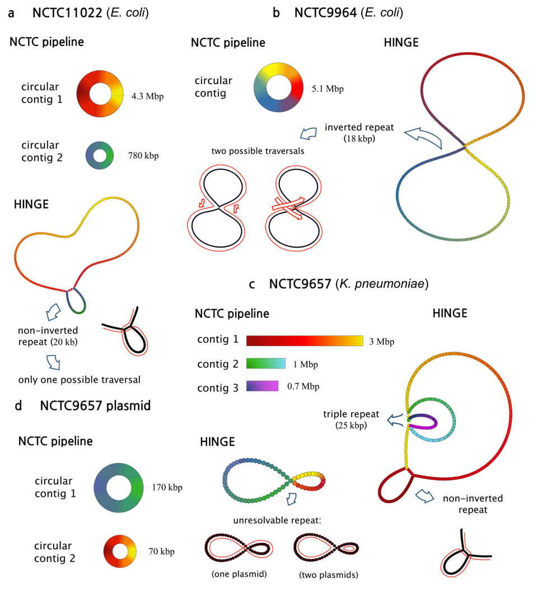

# HINGE-analyses
Analysis accompanying  "HINGE: Long-Read Assembly Achieves Optimal Repeat Resolution" http://biorxiv.org/content/early/2016/07/05/062117


This repository provides an analysis pipeline that reproduces the main results in the paper step-by-step.


###Requirements

The following software needs to be installed (and can be installed using apt-get).

```
build-essential
libhdf5-dev
libboost-all-dev
cmake-3.2
g++-4.9
gcc-4.9
python
python-pip
```


###Instructions to install

```
git clone https://github.com/govinda-kamath/HINGE-analyses.git
cd HINGE-analyses
git submodule foreach --recursive git submodule update --init
git submodule update --init --recursive
./build.sh
source setup.sh
# Optionally you can create a python virtual environment and then install the requirements
pip install -r requirements.txt 
```

The python packages installed by the last line are the following. All of can be installed with `sudo pip install <package>`. While installing forceatlas2, one should make sure that the code is cython compiled to get a 10x improvement in speed.

```
numpy
ujson
cython
forceatlas2
networkx
matplotlib
biopython
bcbio-gff
bcbio-nextgen
colormap
easydev
```

We also need [Aspera connect](http://downloads.asperasoft.com/en/downloads/8?list) to speed up the downloads.

The results of Figure 2 in the paper can be reproduced using [this](https://github.com/govinda-kamath/HINGE-analyses/blob/master/HINGE_pipeline_NCTC.ipynb) notebook.



